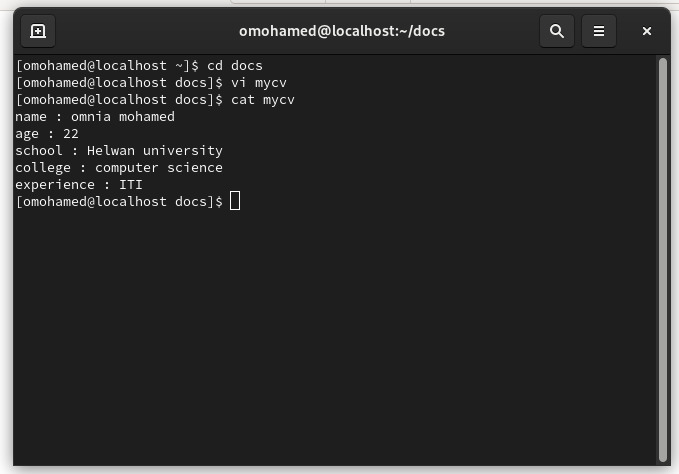
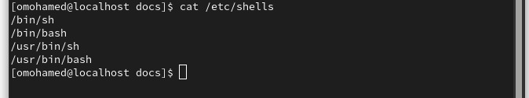
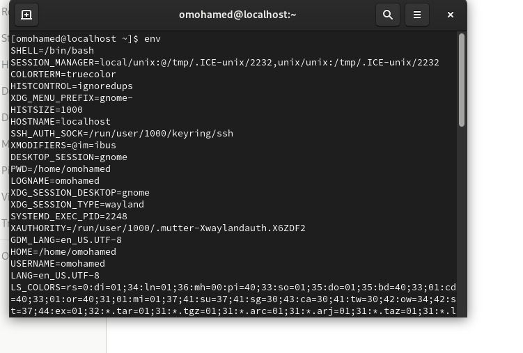
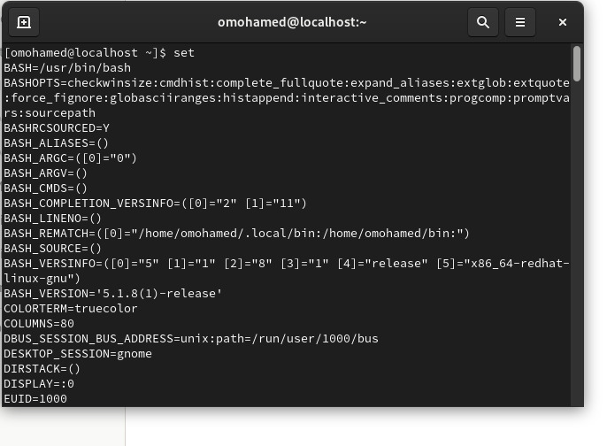
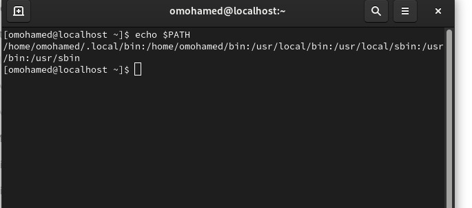
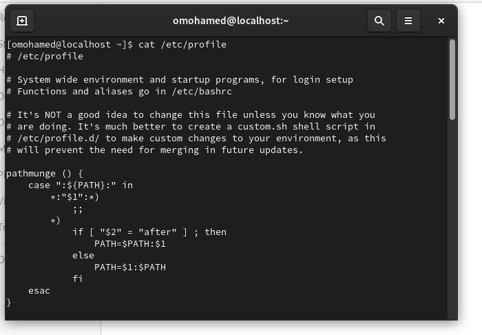
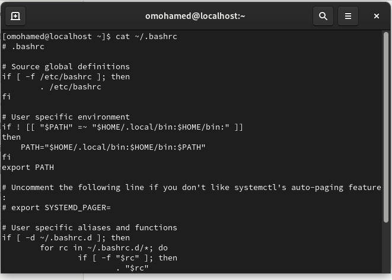
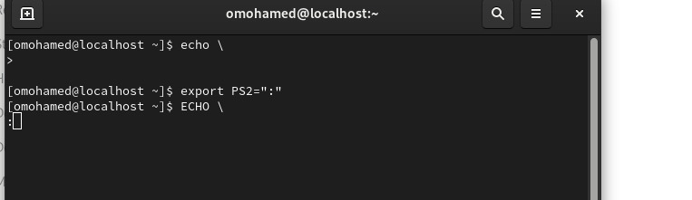
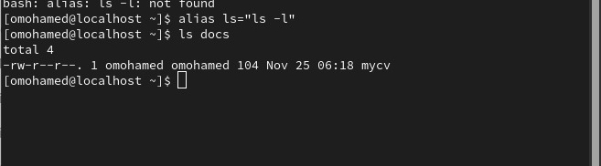

## lab3

### 1. Using vi write your CV in the file mycv. Your CV should include your name, age, school,college, experience,...

### 2. Open mycv file using vi command then: Without using arrows state how to:
a. Move the cursor down one line at time.

j

#### b. Move the cursor up one line at time.
 k

#### c. Search for word age
 /age

#### d. Step to line 5 (assuming that you are in line 1 and file is more than 5 lines).
 :5

#### e. Delete the line you are on and line 5.
 D

#### f. How to step to the end of line and change to writing mode in one-step.
 $

### 3. List the available shells in your system.

### 4. List the environment variables in your current shell.

### 5. List all of the environment variables for the bash shell.

### 6. What are the commands that list the value of a specific variable?

### 7. Display your current shell name.

### 8.. State the initialization files of: sh, ksh, bash.
####    /etc/profile (system-wide)
####     ~/.bash_profile or ~/.bash_login or ~/.profile (user-specific, only the first one found is executed)
####     ~/.bashrc (sourced by interactive non-login shells)

### 9.Edit in your profile to display date at login and change your prompt permanently.

### 10.Execute the following command :

### 11.Create a Bash shell alias named ls for the “ls –l” command

