## lab1

### 1. Install CentOS /RHEL
#### 

### 2. What is the difference between cat and more command?
####   cat: 
  The cat command is a utility command in Linux. One of its most common usages is to print the content of a file onto the standard output stream. Other than that, the cat command also allows us to write some texts into a file.       
#####      
#####       
####   more:
The more command shows the contents of one or more files, one page at a time, but it's rarely used this way. The type command duplicates this functionality and is more commonly used for this particular task.
#####      
#####       

### 3. What is the difference between rm and rmdir using man?
#### rm 
rm removies both files and non-empty directory
##### 
##### 
#####     
#####     
#### rmdir
The rmdir command is used to remove empty directories from our Linux Operating System. Every directory that needs to be removed should not contain any files or subdirectories. Otherwise, the rmdir command cannot remove the directory from our file system.
##### 
#####
##### 
#####     

### 4. Create the following hierarchy under your home directory:
 
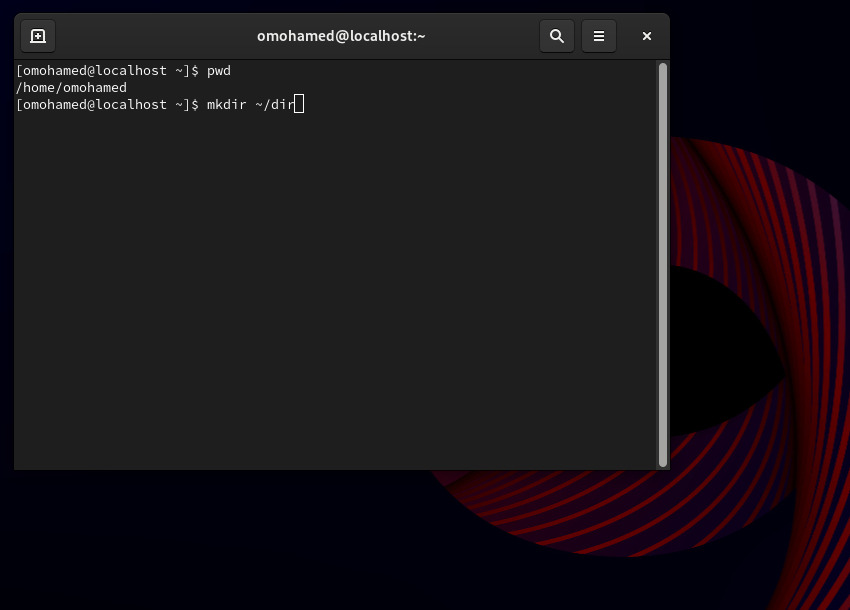
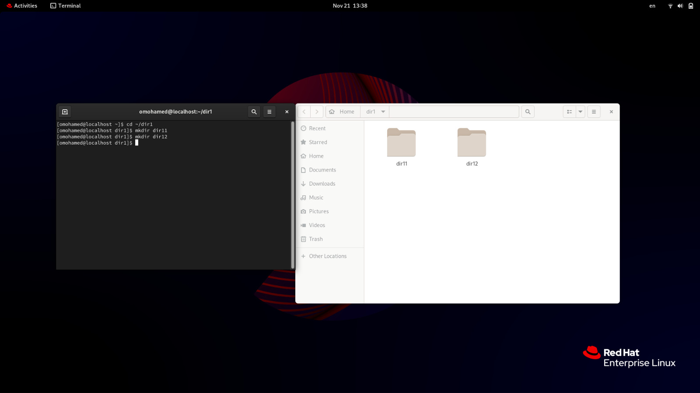
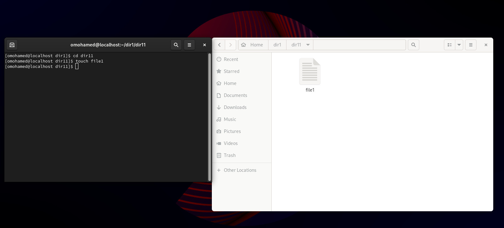
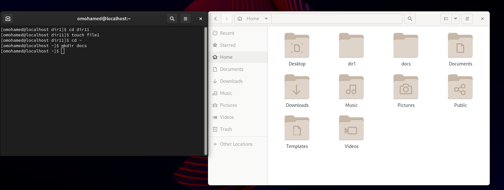
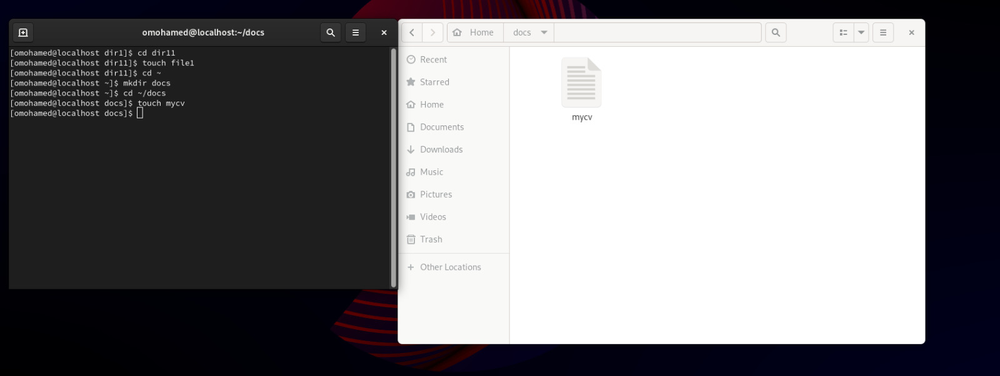

#### a. Remove dir11 in one-step. What did you notice? And how did you overcome that?
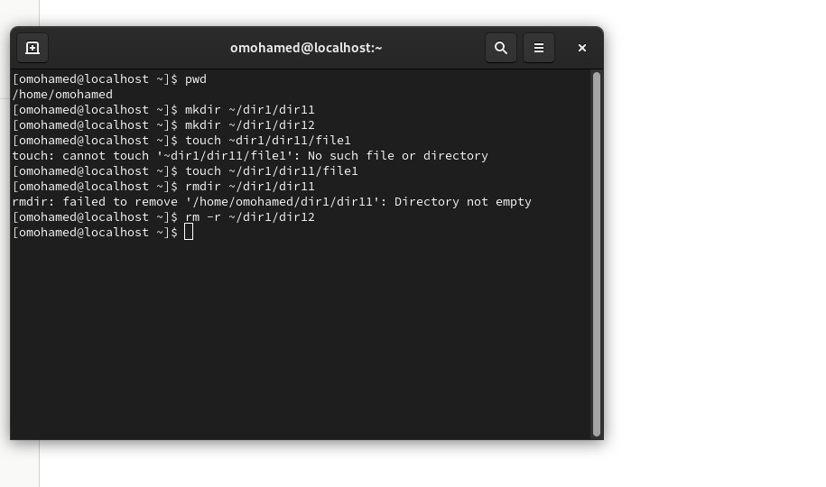
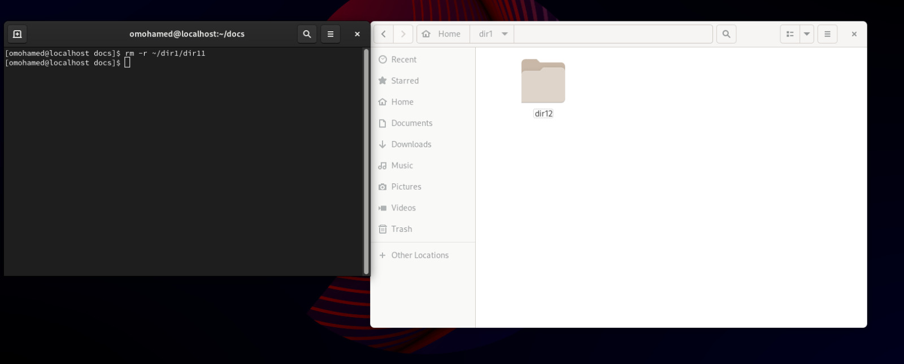

#### b. Then remove dir12 using rmdir –p command. State what happened to the
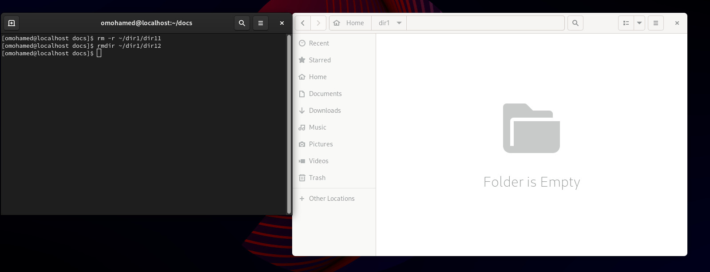

#### c. The output of the command pwd was /home/user. Write the absolute and relative path for the file mycv
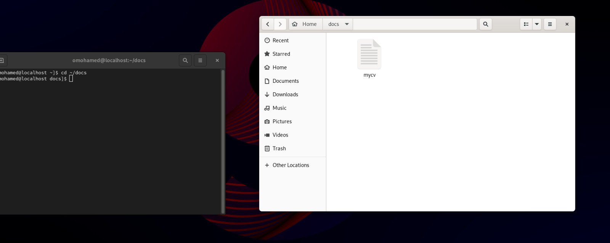
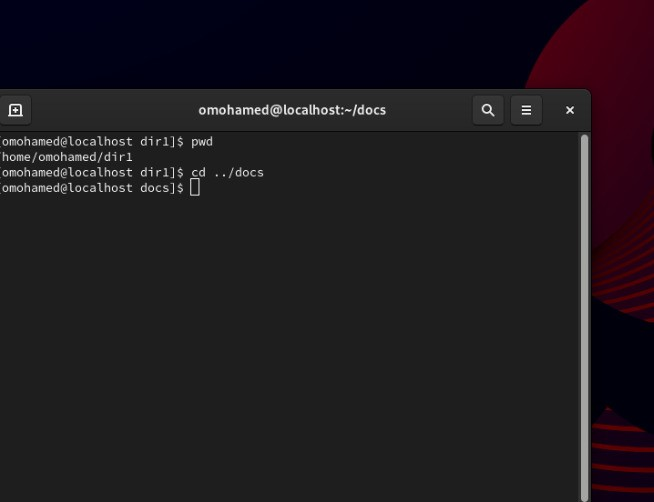

### 5. Copy the /etc/passwd file to your home directory making its name is mypasswd.
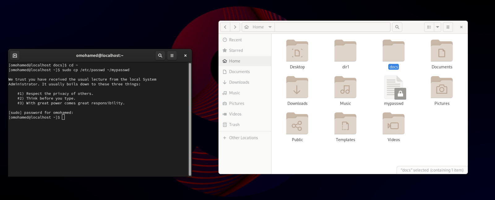

### 6. Rename this new file to be oldpasswd.
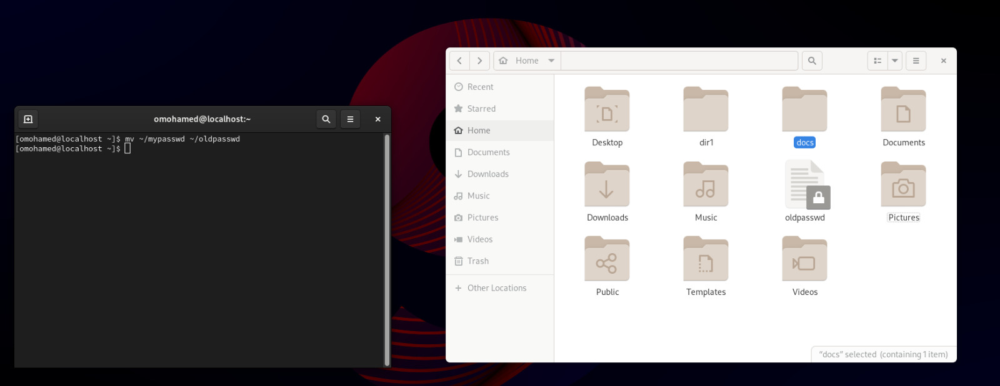

### 7. You are in /usr/bin, list four ways to go to your home directory
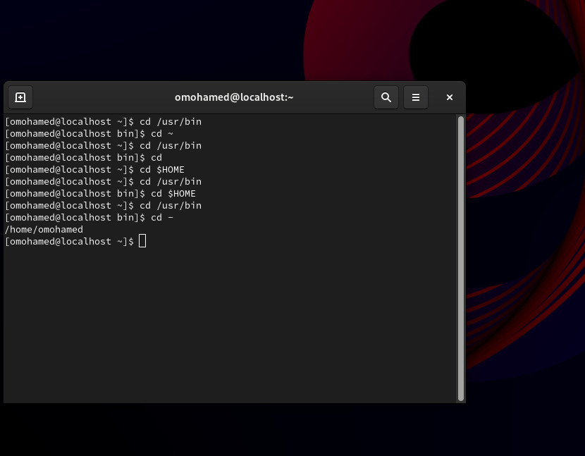

### 8. List Linux commands in /usr/bin that start with letter w
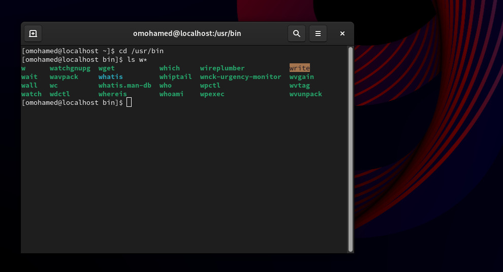

### 9. Display the first 4 lines of /etc/passwd
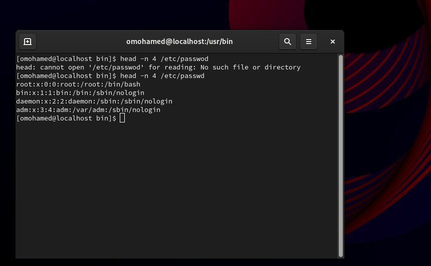

### 10.Display the last 7 lines of /etc/passwd
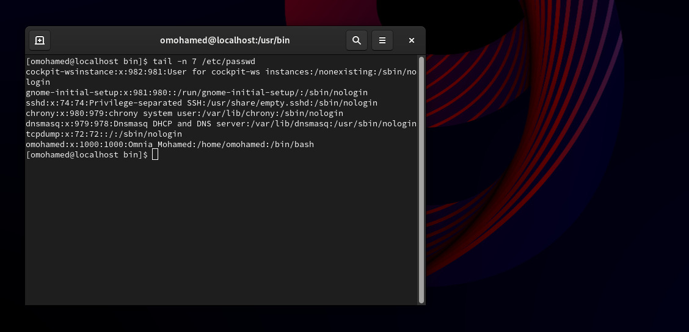

### 11.Display the man pages of passwd the command and the file sequentially in one command.
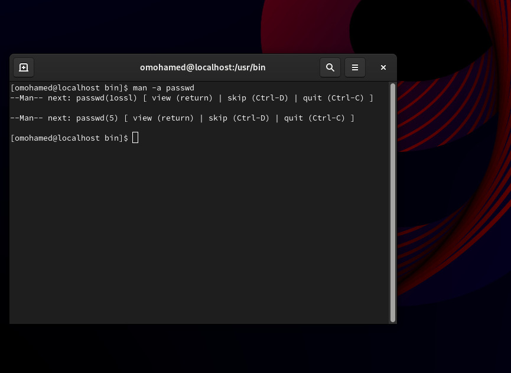

### 12.Display the man page of the passwd file.
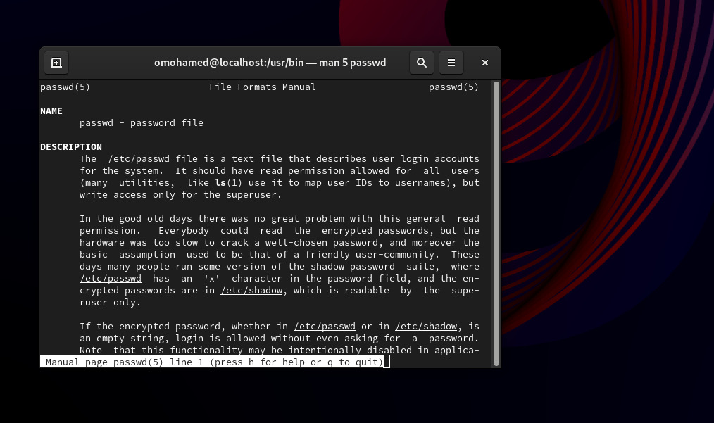

### 13.Display a list of all the commands that contain the keyword passwd in their man page.
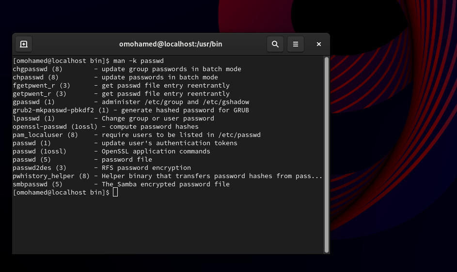
